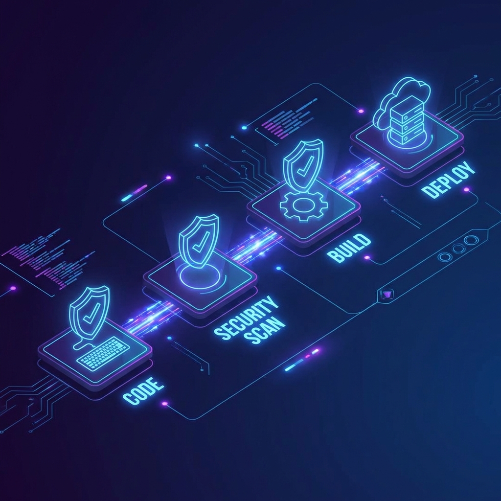

# 🛡️ DevSecOps Security Pipeline

[](https://github.com/ramcreddy-ch/devsecops-security-pipeline/actions/workflows/security.yml)
[](https://opensource.org/licenses/MIT)

> A reference implementation of a "Secure Software Supply Chain" integrating Shift-Left security practices.

## 📊 Pipeline Flow



This project demonstrates how to integrate security at every stage of the SDLC, from local development to production deployment.

## 🔧 Automated Security Controls

- **SAST**: Static analysis using SonarQube and GoLint.
- **SCA**: Software Composition Analysis via Trivy to detect vulnerable dependencies.
- **IaC Scanning**: Checkov and TFSec for Terraform/K8s manifest security.
- **Secret Scanning**: Gitleaks integration to prevent credential leakage.

## 🛠️ Local Development

Use the provided `Makefile` to run security audits locally:

```bash
make scan
make lint
make build
```

---
maintained by **Ramchandra Chintala**
